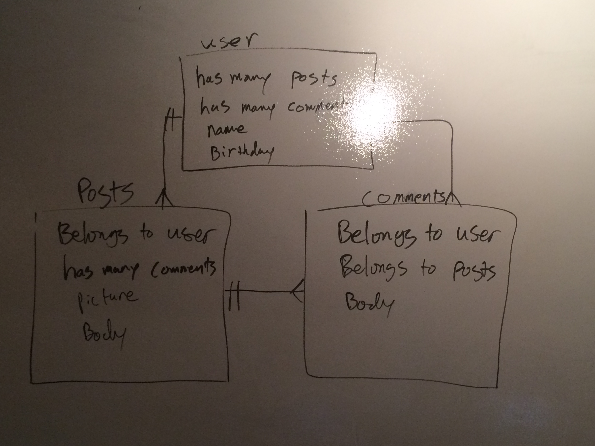

#The GAng

What this application will do 

- Create new users
- Login
- Post information, such as notes from class
- Delete Posts
- Log out

## User Stories

we use this application to cordinate plans/events(concerts and what not) we could all go to. 
if slack is ever down or not running we have another way to communicate with one another. 

